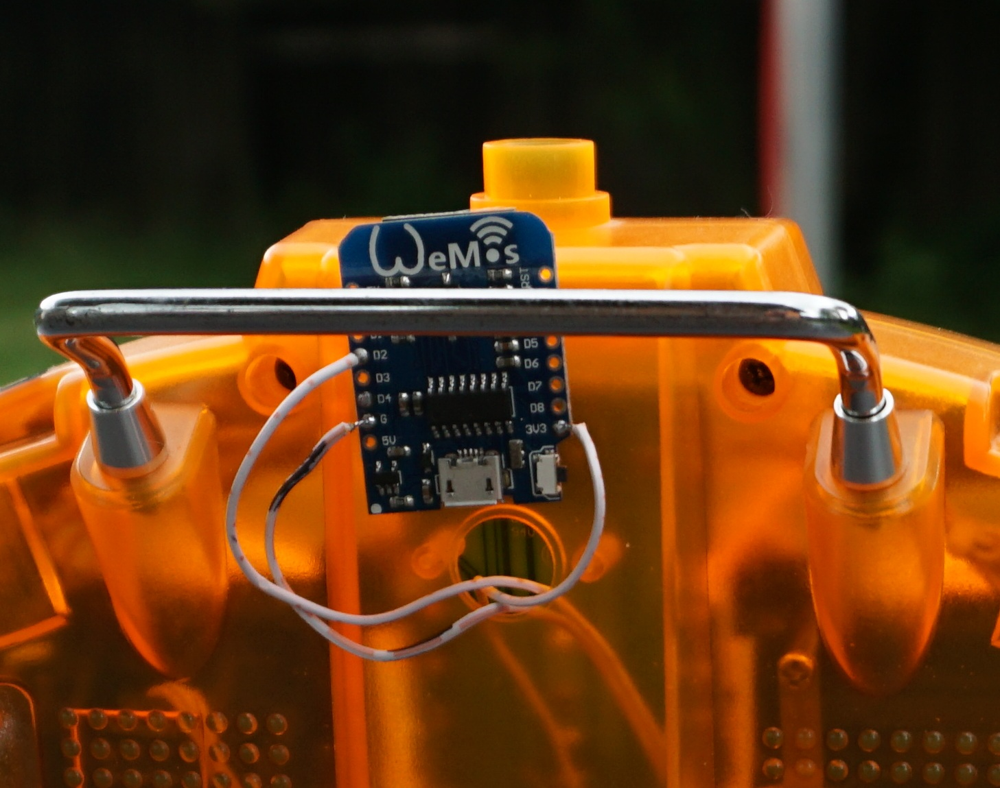

# espnow_RC_TX

Project using the ESP8266 as transmitter and receiver for RC. Done with arduino for esp8266 ide. Uses the ack-less ESPNOW protocol. It uses PPMSUM imput to transmitter. Transmitter PPM in pin is D4. Easily reconfigurable. 

You got to flash the server (receiver) first and write down the MAC. Use arduino serial monitor to see the MAC. You have to add this MAC in the transmitter "remoteMac[]" filed of the firmware. This tells the transmitter to which receiver it is connected, its the "binding".

This does 8 channels and is synchronized to the PPM input.

